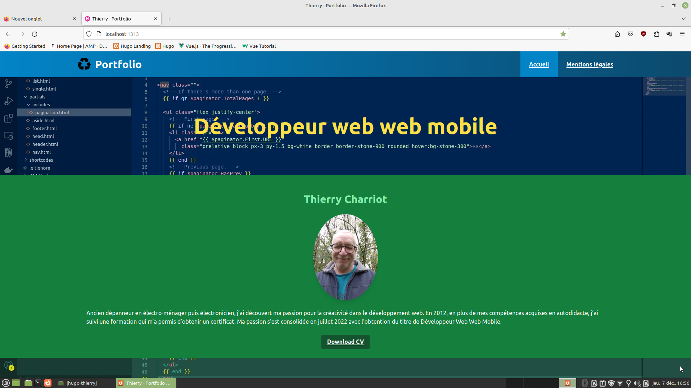

# hugo-thierry

Prise en main du framework [Tailwindcss](https://tailwindcss.com/) avec le générateur de site statique [Hugo](https://gohugo.io/).

Getting started with the [Tailwindcss](https://tailwindcss.com/) framework with the static site generator [Hugo](https://gohugo.io/).

## Installation

## Usage

## Contributing
[makeareadme](https://www.makeareadme.com/)

## License
[Unlicense](https://choosealicense.com/licenses/unlicense/)

